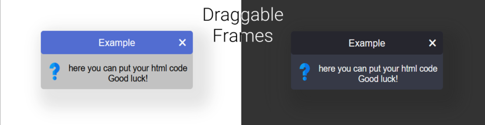

## Usage:
* Add a div element to your web body
* Import scripts and styles
* Create your first draggable frame
```html
<head>
  <link rel="stylesheet" href="frameOptions.css">
</head>
<body>
  ... your code
  <div id="df_spawnArea"></div>
  <script src="dragContent.js"></script>
  <script src="createObject.js"></script>
  
  <script>
        df_create({
          "theme": "dark",
          "title": "Example",
          "content": "here you can put your html code<br>Good luck!<br>",
          "float": 'left',
          "icon": "assets/question.png",
          "rounded": true,
        });
    </script>
</body>
```
